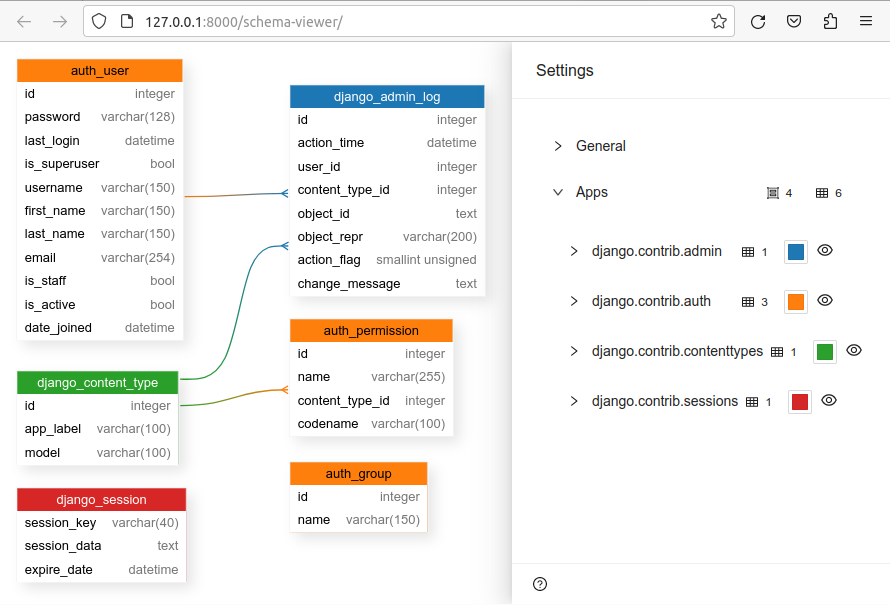

# django-schema-viewer

[](https://github.com/pikhovkin/django-schema-viewer/actions)
[](https://pypi.org/project/django-schema-viewer)
[](https://pypi.org/project/django-schema-viewer)
[](./LICENSE)

[](https://github.com/pypa/hatch)
[](https://github.com/astral-sh/ruff)

Visualizes the DB schema based on Django models.



### Installation

```console
pip install django-schema-viewer
```

### Usage

1. Install the package

2. Add `schema_viewer` to your `INSTALLED_APPS` settings like this:

```python
INSTALLED_APPS = [
    ...,
    'schema_viewer',
    ...,
]
```

3. Add `schema_viewer.urls` to main `urls.py`:

```python
from django.urls import path, include

urlpatterns = [
    ...,
    path('schema-viewer', include('schema_viewer.urls')),
    ...,
]
```

4. Run the project

```console
python manange.py runserver
```

5. Go to http://127.0.0.1:8000/schema-viewer/

### Optional settings

```python
SCHEMA_VIEWER = {
    'apps': [
        'contenttypes',
        'my_app',
    ],
    'exclude': {
        'auth': ['User'],
        'my_app': ['SomeModel'],
    },
}
```

## License

MIT
